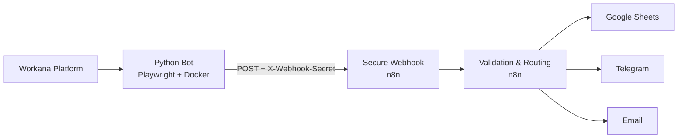

# Freelance-lead-bot– Automated Lead Detection & Notification

## 💼 Business Overview

Many professionals and agencies miss valuable opportunities on freelance marketplaces due to manual monitoring, delayed responses, or lack of structured lead management.

This system automates the entire process:
- Detects new projects in real time
- Filters only relevant opportunities
- Centralizes leads in one place
- Notifies instantly through preferred channels

The result: **faster response times, better lead visibility, and higher conversion potential**.

## 🎯 Who is this for?

This solution is designed for:
- Freelancers managing multiple platforms
- Agencies sourcing projects at scale
- Consultants who rely on fast lead response
- Teams that want visibility without manual effort

## ✅ Key Benefits

- **Zero manual monitoring**
- **Immediate notifications**
- **Centralized lead tracking**
- **Secure and controlled automation**
- **Scalable architecture**

End-to-end automation system for detecting new opportunities on Workana and securely distributing them across multiple channels using n8n.

## 🚀 What it does
- Monitors Workana projects using Playwright
- Detects relevant leads based on keywords
- Stores results locally
- Sends normalized leads securely to n8n
- Distributes data to Google Sheets, Telegram and Email

## 🧱 Architecture
Python Bot (Docker) → Secure Webhook → n8n → Channels (Sheets / Telegram / Gmail)

## 🔐 Security
- Webhook protected via `X-Webhook-Secret` header
- Sensitive values managed through environment variables
- Server-side validation in n8n before workflow execution

## 🛠️ Tech Stack
- Python
- Playwright
- Docker
- n8n
- Google Sheets API
- Telegram Bot API

## 📂 Project Structure

app/
config/
Dockerfile
main.py
requirements.txt

## ▶️ Execution
The bot runs as a Docker service and executes in configurable cycles.

## 📌 Note
This project is a functional example of an end-to-end automation system focused on lead acquisition.

## n8n Workflow Template

This repository includes a **sanitized n8n workflow template**:

**Path:** `config/N8N/workana-lead-automation.n8n.json`

Purpose:
- Receives leads via secure webhook
- Validates request headers
- Stores data in Google Sheets
- Sends Telegram notifications
- Sends email alerts

This file is safe for public repositories.  
Secrets and credentials must be configured manually in n8n.

## 🧩 Architecture Diagram

## 🔐 Production Hardening Checklist

Before using this system in production, the following measures are recommended:

### Webhook Security
- Use a strong, rotated `X-Webhook-Secret`
- Restrict webhook access by IP if possible
- Enable rate limiting on the webhook endpoint

### Secrets Management
- Store all secrets in environment variables
- Never commit `.env` files to the repository
- Rotate credentials periodically

### n8n Hardening
- Disable public workflow access
- Use credentials with minimum required permissions
- Enable execution logs and error workflows
- Protect the n8n instance behind authentication or VPN

### Python Bot
- Run the bot inside a restricted Docker container
- Limit outbound network access if possible
- Add retries and timeout handling for network calls

### Monitoring
- Enable logging and alerting for failed executions
- Monitor webhook traffic and execution volume

## 🧠 Use Case – FactoriAI

This project represents a real-world use case developed under the FactoriAI philosophy:
using automation and intelligent orchestration to eliminate manual, repetitive work.

### Business Problem
Manually monitoring platforms like Workana is time-consuming and inefficient.
Opportunities are often missed due to delayed responses or lack of visibility.

### Solution
An automated, secure pipeline that:
- Continuously detects new opportunities
- Filters only relevant leads
- Distributes information instantly
- Keeps full control over data and execution

### Value Delivered
- Reduced reaction time
- Improved lead conversion
- Full operational visibility
- Scalable and maintainable architecture
---

Built with ⚙️ by **FactoriAI**  
Mindful intelligence for modern operations.

